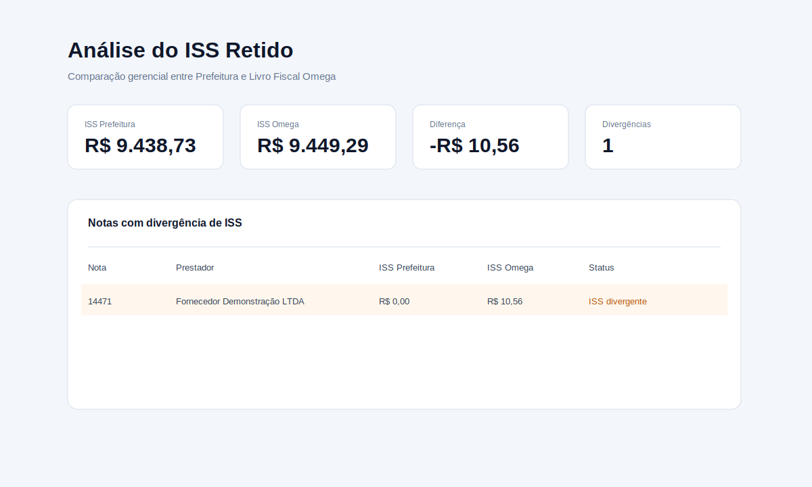
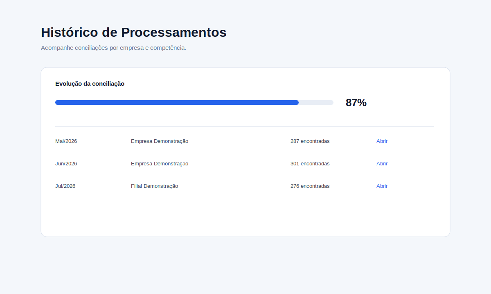
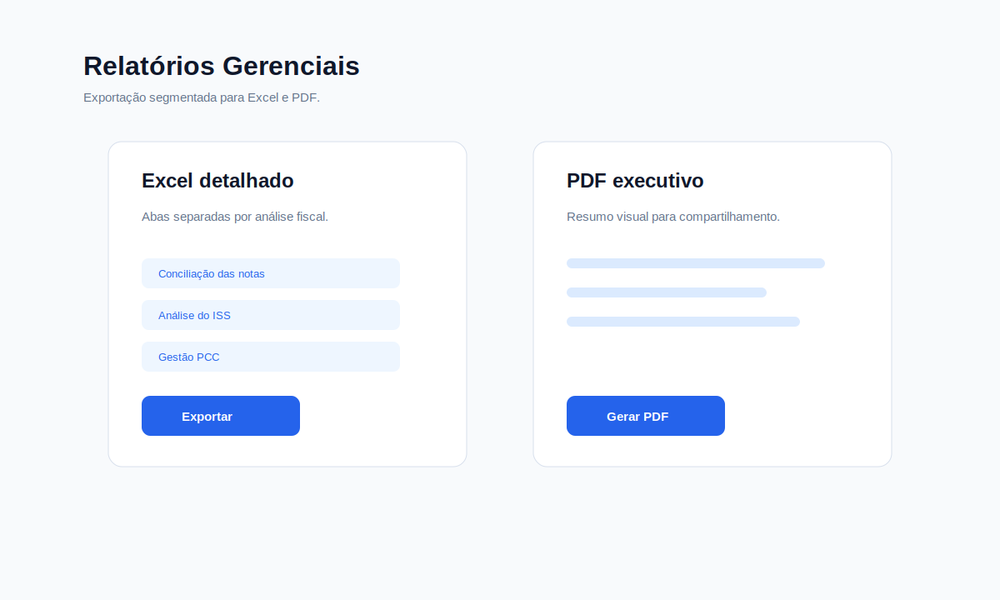

# FeCarlos - Concilia

## Plataforma Inteligente para Conciliação de NFS-e

O **FeCarlos - Concilia** é uma aplicação desenvolvida para automatizar o processo de conciliação de Notas Fiscais de Serviço entre diferentes fontes de dados, reduzindo atividades manuais e aumentando a confiabilidade das análises fiscais.

O projeto integra múltiplos layouts de importação, realiza comparações automáticas e gera indicadores gerenciais por meio de dashboards e relatórios.

> Este repositório apresenta apenas a estrutura do projeto para fins de portfólio. Dados internos, regras de negócio específicas e integrações proprietárias foram omitidos.


## Objetivos

- Automatizar conciliações fiscais.
- Padronizar diferentes layouts de entrada.
- Identificar divergências automaticamente.
- Gerar indicadores gerenciais.
- Exportar relatórios em Excel e PDF.
- Reduzir retrabalho em conferências manuais.
- Apoiar a tomada de decisão fiscal e tributária.

## Principais Funcionalidades

- Conciliação automática de documentos.
- Dashboard executivo por competência.
- Análise de ISS.
- Análise tributária.
- Gestão de retenções federais (PCC).
- Histórico de processamentos.
- Exportação para Excel.
- Exportação para PDF.
- Cadastro de empresas.
- Manual integrado.
- Controle de notas canceladas e substituídas.
- Logs de validação e processamento.

## Fluxo do Sistema

```text
Cadastro da Empresa
        │
        ▼
Importação dos Arquivos
        │
        ▼
Validação
        │
        ▼
Processamento
        │
        ▼
Dashboard
        │
        ▼
Análises
        │
        ▼
Exportação
```

## Arquitetura

```text
Portal Nacional / Prefeitura / Omega
                 │
                 ▼
        Importação de Dados
                 │
                 ▼
        Motor de Conciliação
                 │
       ┌─────────┼─────────┐
       ▼         ▼         ▼
  Dashboard   Análises  Relatórios
                 │
                 ▼
             Excel • PDF
```

Mais detalhes em [docs/arquitetura.md](docs/arquitetura.md).

## Tecnologias Utilizadas

- Python
- React
- JavaScript
- FastAPI
- SQLite
- PostgreSQL
- Docker
- Pandas
- OpenPyXL
- ReportLab
- SQLAlchemy
- Vite
- PyInstaller
- Inno Setup

## Benefícios

- Redução de processos manuais.
- Aumento da confiabilidade das análises.
- Padronização dos critérios de conferência.
- Melhor rastreabilidade das divergências.
- Apoio à tomada de decisão.
- Histórico organizado por empresa e competência.
- Relatórios prontos para compartilhamento.

## Imagens do Sistema

As telas abaixo são demonstrativas e utilizam dados fictícios.

| Login | Nova Conciliação |
| --- | --- |
|  |  |

| Dashboard | Análise de ISS |
| --- | --- |
|  |  |

| Gestão PCC | Histórico |
| --- | --- |
|  |  |

| Relatórios | Arquitetura |
| --- | --- |
|  |  |

## Roadmap

- API de integração.
- Integração com Power BI.
- Classificação inteligente de divergências.
- Alertas automáticos.
- Workflow de tratativa e aprovação.
- Perfis de acesso por usuário.
- Atualização automática da versão instalável.

## Segurança e Privacidade

Este repositório é apenas um case público. O código-fonte real, dados fiscais, regras sensíveis, arquivos de clientes e instaladores não fazem parte desta publicação.

Veja também: [docs/privacidade.md](docs/privacidade.md).

## Autor

**Fernando Carlos Beltrame**

Fiscal & Tributário | Desenvolvimento de Sistemas | Automação | Python | SQL | Power BI
