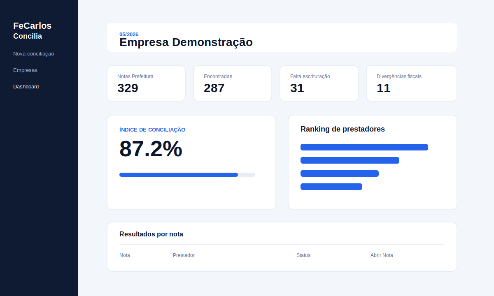
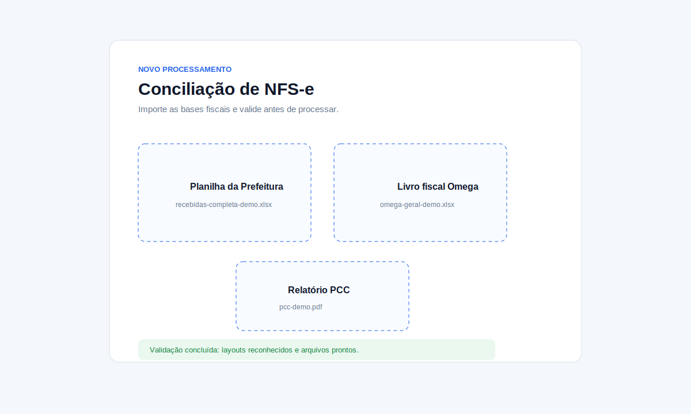
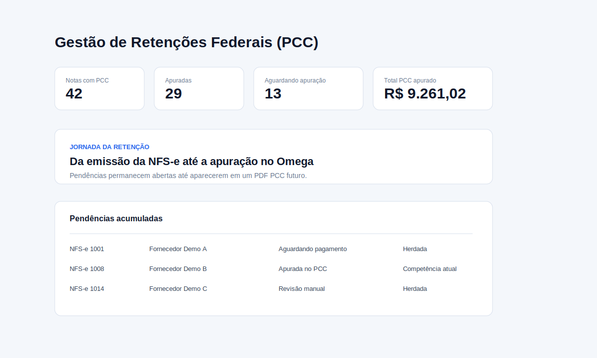
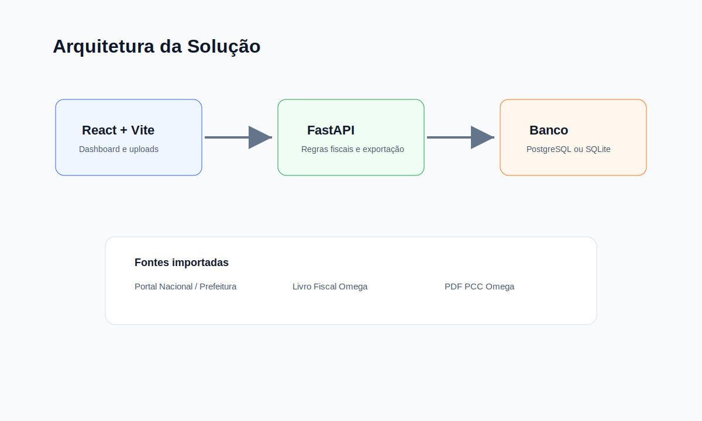

# FeCarlos - Concilia

## Plataforma Inteligente para Conciliação de NFS-e

O **FeCarlos - Concilia** é uma aplicação desenvolvida para automatizar o processo de conciliação de Notas Fiscais de Serviço entre diferentes fontes de dados, reduzindo atividades manuais e aumentando a confiabilidade das análises fiscais.

O projeto integra múltiplos layouts de importação, realiza comparações automáticas e gera indicadores gerenciais por meio de dashboards e relatórios.

> Este repositório apresenta apenas a estrutura do projeto para fins de portfólio. Dados internos, regras de negócio específicas e integrações proprietárias foram omitidos.



## Visão Geral

O **FeCarlos - Concilia** foi desenvolvido para apoiar a conferência de NFS-e em rotinas fiscais. O sistema centraliza a importação de relatórios, organiza pendências, separa divergências por tipo e gera relatórios gerenciais para análise e compartilhamento.

A solução foi pensada para uso local ou interno, com foco em produtividade, rastreabilidade e clareza operacional.

## Problema Resolvido

Antes do sistema, a conferência dependia de planilhas manuais, filtros, chaves concatenadas e análise nota a nota. Isso gerava risco de erro, perda de tempo e dificuldade para explicar diferenças entre bases fiscais.

O projeto resolve esse fluxo com:

- painel gerencial por competência;
- separação entre notas encontradas, ausentes e divergentes;
- análise fiscal individualizada;
- acompanhamento de retenções federais;
- histórico por empresa;
- exportações em Excel e PDF.

## Principais Funcionalidades

- Cadastro de empresas, matriz e filiais.
- Processamento por competência.
- Importação de relatórios da Prefeitura/Portal Nacional.
- Importação de relatórios do Livro Fiscal Omega.
- Dashboard de conciliação das notas.
- Tela de falta de escrituração.
- Análise do ISS retido.
- Gestão de retenções federais PCC.
- Controle de notas canceladas e substituídas.
- Logs de processamento.
- Exportação gerencial em Excel e PDF.
- Versão instalável para Windows.

## Telas Demonstrativas

| Dashboard | Importação de bases |
| --- | --- |
|  |  |

| Gestão PCC | Arquitetura |
| --- | --- |
|  |  |

## Tecnologias Utilizadas

- Python
- FastAPI
- Pandas
- SQLAlchemy
- React
- Vite
- PostgreSQL
- SQLite para versão desktop
- Docker
- PyInstaller
- Inno Setup

## Arquitetura em Alto Nível

```text
Relatórios fiscais
       │
       ▼
Normalização e validação
       │
       ▼
Motor de conciliação
       │
       ▼
Dashboard, histórico e exportações
```

Mais detalhes em [docs/arquitetura.md](docs/arquitetura.md).

## Resultado Esperado

O sistema permite que o usuário deixe de trabalhar apenas com planilhas soltas e passe a ter uma visão estruturada das pendências fiscais, com indicadores, rastreabilidade e relatórios prontos para conferência.

## Roadmap

- Melhorar telas de auditoria.
- Criar base fictícia para demonstração pública.
- Evoluir permissões por usuário.
- Criar instalador com atualização automática.
- Adicionar testes automatizados dos leitores de arquivos.

## Segurança e Privacidade

Este repositório é apenas um case público. O código-fonte real, dados fiscais, regras sensíveis, arquivos de clientes e instaladores não fazem parte desta publicação.

